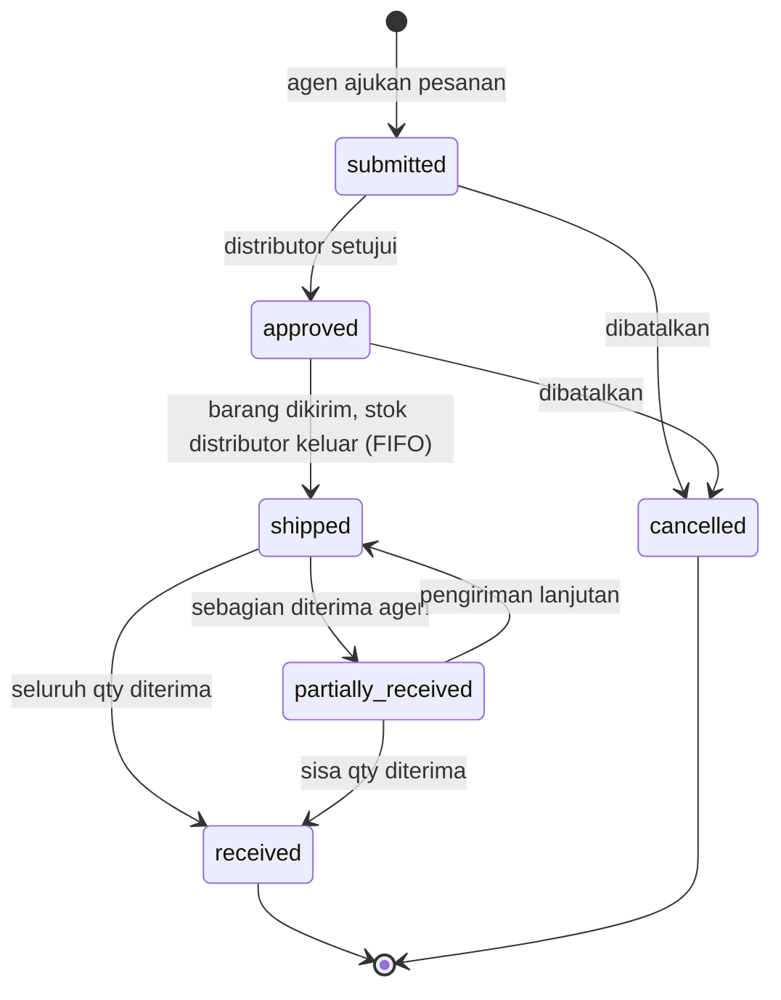
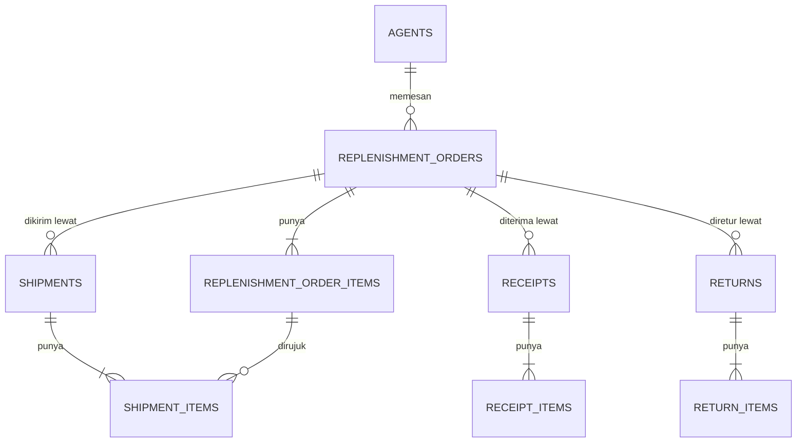

# PRD — Replenishment Order Distributor ke Agen

> Product Requirement Document untuk alur bisnis inti yang direstrukturisasi
> pada AI Innovation Sprint 2026. Batas cakupan ada di [SCOPE.md](SCOPE.md).

| | |
|---|---|
| **Produk** | TITANIE — ERP distributor Harnica (CV Suhara Botanica) |
| **Modul** | Replenishment Order (Distribusi) |
| **Versi** | 1.0 — 13 Agustus 2026 |
| **Status** | Sudah berjalan, direstrukturisasi pada sprint ini |

---

## 1. Latar Belakang

Harnica menjual produk herbal lewat jaringan partner, bukan langsung ke konsumen. Distributor memegang stok barang jadi, agen membeli stok dari distributor untuk dijual ulang ke reseller dan konsumen akhir. Perpindahan stok dari distributor ke agen inilah yang disebut **replenishment order**.

Alur ini adalah nadi bisnisnya. Kalau salah, dampaknya berlapis: stok distributor tidak akurat, HPP agen salah sehingga marginnya tidak terukur, dan produk kedaluwarsa bisa lolos ke pasar. Untuk produk herbal yang punya tanggal kedaluwarsa, risiko terakhir bukan sekadar masalah pembukuan.

Sebelum sprint ini, logika pembuatan order menumpuk di controller dan nilai status ditulis sebagai string literal di controller, service, dan view. Akibatnya ada dua masalah nyata:

1. Tombol persetujuan tidak pernah dipasang di UI, padahal endpoint-nya ada. Order bisa langsung dikirim tanpa disetujui.
2. Tidak ada satu tempat yang bisa dibaca untuk mengetahui status apa saja yang mungkin dan transisi mana yang sah.

---

## 2. Tujuan

| Tujuan | Ukuran keberhasilan |
|--------|---------------------|
| Setiap perpindahan stok distributor ke agen punya jejak yang bisa diaudit | Setiap penerimaan barang punya order, shipment, dan receipt yang saling terhubung |
| HPP agen terbentuk otomatis dari harga transfer | Cost layer agen terbentuk saat penerimaan, tanpa input manual |
| Tanggal kedaluwarsa tidak hilang saat barang berpindah gudang | `shipment_items.expiry_date` terisi dari cost layer yang terpakai |
| Status order punya satu sumber kebenaran | Semua nilai status berasal dari `App\Support\ReplenishmentStatus` |
| Order tidak bisa dikirim sebelum disetujui | Percobaan kirim dari status `submitted` ditolak dengan pesan jelas |
| Alur bisa dijelaskan AI tanpa penjelasan manusia | Chatbot menjawab pertanyaan alur ini dari `docs/` |

**Bukan tujuan sprint ini:** menghitung komisi, mengelola jenjang partner, dan integrasi API kurir. Alasannya ada di [SCOPE.md](SCOPE.md).

---

## 3. Pengguna dan Kebutuhannya

| Peran | Kebutuhan | Akses |
|-------|-----------|-------|
| **Admin distributor** | Melihat semua order masuk, menyetujui, mengirim barang dengan nomor resi | Menu `Replenishment`, semua aksi |
| **Staf gudang distributor** | Mengetahui apa yang harus dikirim dan berapa sisa yang belum terkirim | `Replenishment` baca dan ubah |
| **Agen** | Mengajukan pesanan, memantau status dan nomor resi, mengonfirmasi penerimaan | Layar yang sama, otomatis terbatas pada order miliknya |
| **Finance** | Mengetahui status pembayaran tiap order | `Replenishment` baca |

Pembatasan akses agen tidak bergantung pada pilihan filter di UI, melainkan ditegakkan di controller lewat relasi `partnerAgent` pada user.

---

## 4. Alur Utama

Retur berjalan di luar alur status order: bisa dilakukan setelah barang diterima, tanpa mengubah status order, tapi mengurangi stok agen dan menambah stok distributor kembali.

---

## 5. Kebutuhan Fungsional

### FR-1 — Membuat pesanan

Pesanan dibuat dengan minimal satu baris item. Setiap baris wajib memuat varian produk, qty lebih besar dari nol, dan harga satuan.

- Nomor order dibuat otomatis dengan format `RPO-YYYYMM-NNNN`.
- Subtotal per baris dihitung sistem, bukan dikirim dari form.
- Pesanan baru selalu berstatus `submitted`.
- Bila varian produk tidak ditemukan, pembuatan pesanan **gagal dengan pesan jelas**. Sebelumnya baris seperti ini dilewati diam-diam sehingga pesanan terbentuk dengan item yang hilang.
- User agen hanya boleh membuat pesanan untuk dirinya sendiri; percobaan mengirim `agent_id` lain ditolak dengan 403.

### FR-2 — Menyetujui pesanan

- Hanya bisa dari status `submitted`.
- Tidak boleh dilakukan user agen.
- Tombol persetujuan tampil di halaman detail hanya ketika statusnya memungkinkan.

### FR-3 — Mengirim barang

- Hanya bisa dari status `approved`, `shipped`, atau `partially_received` — pengiriman boleh bertahap.
- **Kurir dan nomor resi wajib**, supaya agen bisa melacak kiriman.
- Qty kirim per baris dibatasi sisa yang belum terkirim.
- Stok keluar dari gudang Barang Jadi distributor memakai FIFO.
- Tanggal kedaluwarsa dari cost layer yang terpakai disimpan di item shipment agar FEFO tetap terjaga sampai ke agen.
- Shipment dibuat berstatus `in_transit`; order menjadi `shipped`.

### FR-4 — Menerima barang

- Dilakukan per shipment.
- Stok masuk ke gudang agen pada **harga transfer** dari order item — inilah HPP agen.
- Tanggal kedaluwarsa diteruskan dari item shipment.
- Shipment menjadi `delivered`.
- Status order dihitung ulang otomatis: `received` bila semua qty terpenuhi, `partially_received` bila sebagian.

### FR-5 — Retur barang

- Hanya bisa setelah ada barang yang diterima.
- Qty retur dibatasi qty diterima dikurangi qty yang sudah diretur.
- Stok keluar dari gudang agen, lalu masuk kembali ke gudang Barang Jadi distributor pada harga transfer yang sama.

### FR-6 — Melihat daftar dan detail

- Daftar menampilkan nomor order, tanggal, agen, invoice, status pembayaran, total, dan status order.
- Detail menampilkan item beserta qty dipesan, dikirim, diterima, diretur, ditambah riwayat pengiriman, penerimaan, dan retur.
- Label status ditampilkan dalam Bahasa Indonesia dari satu sumber yang sama, bukan diformat ulang di tiap view.

---

## 6. Aturan Bisnis

| Kode | Aturan |
|------|--------|
| BR-1 | Stok tidak boleh diubah langsung; semua mutasi lewat `StockMutationService` supaya ledger dan cost layer tetap konsisten |
| BR-2 | Pengurangan stok distributor memakai FIFO berdasarkan cost layer |
| BR-3 | HPP agen sama dengan harga transfer di order item, bukan HPP distributor |
| BR-4 | Tanggal kedaluwarsa harus ikut berpindah gudang agar FEFO bisa ditegakkan |
| BR-5 | Nomor resi wajib pada setiap pengiriman |
| BR-6 | Order harus disetujui sebelum bisa dikirim |
| BR-7 | Pengiriman dan penerimaan boleh bertahap; status order mencerminkan qty yang benar-benar diterima |
| BR-8 | Setiap operasi yang menyentuh lebih dari satu tabel dibungkus satu transaksi database |
| BR-9 | Agen hanya bisa melihat dan membuat order miliknya sendiri |

---

## 7. Model Data

Semua tabel order dan logistik berada di schema `distribution`, agen di schema `partner`, stok dan cost layer di schema `product`.

Kolom akumulasi pada `replenishment_order_items` — `qty_shipped`, `qty_received`, `qty_returned` — adalah sumber perhitungan sisa dan penentu status order.

**Tidak ada perubahan skema pada sprint ini.**

---

## 8. Kebutuhan Non-Fungsional

| Aspek | Ketentuan |
|-------|-----------|
| Konsistensi data | Semua operasi stok atomik dalam satu transaksi; kegagalan di tengah tidak menyisakan stok yang sudah bergerak |
| Otorisasi | Setiap route dilindungi permission berbasis nama menu; pembatasan data agen ditegakkan di controller |
| Penanganan error | Kegagalan operasi stok dikembalikan sebagai pesan berbahasa Indonesia, bukan stack trace |
| Jejak audit | Setiap tabel menyimpan `created_by` dan `updated_by`; setiap mutasi stok meninggalkan baris di `product_stock_movements` |
| Bisa dijelaskan AI | Alur, status, dan aturan bisnis terdokumentasi di `docs/` sehingga terbaca chatbot lewat `search_docs` |

---

## 9. Yang Diketahui Belum Selesai

Dicatat terbuka, bukan disembunyikan:

- **Status `draft` belum dipakai.** Order langsung dibuat sebagai `submitted`. Konstantanya sudah disiapkan untuk fitur simpan-sebagai-draf nanti.
- **Pembatalan belum ada di UI.** Transisi ke `cancelled` sudah didefinisikan di state machine tapi belum ada tombolnya.
- **Status pembayaran masih diinput manual.** Belum terhubung ke modul pembayaran maupun akuntansi.
- **Belum ada test otomatis.** Repo belum punya `tests/`. Verifikasi masih manual, ditambah smoke test basis pengetahuan chatbot di `scripts/ai-docs-knowledge-test.php`.
- **Retur tidak mengubah status order.** Bisa membingungkan bila seluruh isi order diretur — ordernya tetap tercatat `received`.

---

## 10. Rencana ke Depan

Prioritas berikutnya setelah sprint, berdasarkan gap yang ditemukan saat audit:

1. **Commission engine** — tabel akrual komisi yang bisa diaudit, dipicu penjualan partner. Saat ini ekonomi partner hanya diatur lewat tier harga.
2. **Atribusi partner pada sales order** — `sales_orders` belum punya `agent_id` atau `reseller_id`, sehingga tidak ada pemicu alami untuk komisi.
3. **Batch sampai ke penjualan** — `product_batches` sudah ada tapi `sales_order_items` belum menyimpan `batch_id`, jadi FEFO belum bisa ditegakkan saat picking penjualan.
4. **Jenjang membership partner** — Silver sampai Diamond, terhubung ke target dan kepatuhan harga.
5. **Integrasi API kurir** — menggantikan input nomor resi manual.
6. **Test otomatis** — dimulai dari alur replenishment sebagai kandidat pertama karena logikanya paling berisiko.

---

## 11. Dokumen Terkait

| Dokumen | Isi |
|---------|-----|
| [SCOPE.md](SCOPE.md) | Batas cakupan sprint |
| [ARCHITECTURE.md](ARCHITECTURE.md) | Arsitektur sistem dan peta modul |
| [AI_CONTEXT.md](AI_CONTEXT.md) | Konteks repo untuk AI |
| [STATUS.md](STATUS.md) | Kesehatan proyek dan blocker |
