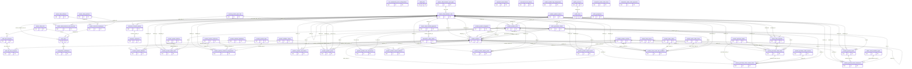

# ERD from Laravel Migrations

Generated from `database/migrations`.

```mermaid
erDiagram
  auth_iam_accesses {
    uuid id PK
  }
  auth_iam_has_accesses {
    uuid id PK
  }
  auth_users {
    uuid id PK
  }
  configuration_notifications {
    uuid id PK
  }
  crm_membership_point_configurations {
    uuid id PK
  }
  customer_customer_groups {
    uuid id PK
  }
  customer_customers {
    uuid id PK
  }
  failed_jobs {
    uuid id PK
  }
  human_resources_employees {
    uuid id PK
  }
  master_data_business_unit_branches {
    uuid id PK
  }
  master_data_business_unit_types {
    uuid id PK
  }
  master_data_business_units {
    uuid id PK
  }
  master_data_divisions {
    uuid id PK
  }
  master_data_menus {
    uuid id PK
  }
  master_data_method_payments {
    uuid id PK
  }
  master_data_positions {
    uuid id PK
  }
  master_data_roles {
    uuid id PK
  }
  master_data_suppliers {
    uuid id PK
  }
  password_reset_tokens {
    uuid id PK
  }
  personal_access_tokens {
    uuid id PK
  }
  product_attribute_definitions {
    uuid id PK
  }
  product_attribute_values {
    uuid id PK
  }
  product_product_attributes {
    uuid id PK
  }
  product_product_batch_stock {
    uuid id PK
  }
  product_product_batches {
    uuid id PK
  }
  product_product_categories {
    uuid id PK
  }
  product_product_collection_assignments {
    uuid id PK
  }
  product_product_collections {
    uuid id PK
  }
  product_product_cost_history {
    uuid id PK
  }
  product_product_natures {
    uuid id PK
  }
  product_product_price_lists {
    uuid id PK
  }
  product_product_prices {
    uuid id PK
  }
  product_product_stock {
    uuid id PK
  }
  product_product_stock_movements {
    uuid id PK
  }
  product_product_tag_assignments {
    uuid id PK
  }
  product_product_tags {
    uuid id PK
  }
  product_product_unit_conversions {
    uuid id PK
  }
  product_product_units {
    uuid id PK
  }
  product_product_variant_attributes {
    uuid id PK
  }
  product_product_variant_prices {
    uuid id PK
  }
  product_product_variant_stock {
    uuid id PK
  }
  product_product_variants {
    uuid id PK
  }
  product_products {
    uuid id PK
  }
  product_purchase_order_items {
    uuid id PK
  }
  product_purchase_order_receive_items {
    uuid id PK
  }
  product_purchase_order_receives {
    uuid id PK
  }
  product_purchase_orders {
    uuid id PK
  }
  product_sales_order_item_modifiers {
    uuid id PK
  }
  product_sales_order_items {
    uuid id PK
  }
  product_sales_orders {
    uuid id PK
  }
  public_cities {
    uuid id PK
  }
  public_parameter_details {
    uuid id PK
  }
  public_parameters {
    uuid id PK
  }
  public_provinces {
    uuid id PK
  }
  public_stock_mutation_types {
    uuid id PK
  }
  transaction_sales_order_items {
    uuid id PK
  }
  transaction_sales_order_payments {
    uuid id PK
  }
  transaction_sales_orders {
    uuid id PK
  }
  master_data_roles ||--o{ auth_iam_accesses : "role_id"
  auth_iam_accesses ||--o{ auth_iam_has_accesses : "iam_access_id"
  master_data_menus ||--o{ auth_iam_has_accesses : "sidebar_menu_id"
  master_data_business_units ||--o{ auth_users : "current_business_unit_id"
  human_resources_employees ||--o{ auth_users : "employee_id"
  master_data_roles ||--o{ auth_users : "role_id"
  auth_users ||--o{ configuration_notifications : "user_id"
  master_data_business_units ||--o{ customer_customer_groups : "branch_id"
  product_product_price_lists ||--o{ customer_customer_groups : "price_list_id"
  customer_customer_groups ||--o{ customer_customers : "customer_group_id"
  master_data_business_units ||--o{ human_resources_employees : "business_unit_id"
  master_data_divisions ||--o{ human_resources_employees : "division_id"
  master_data_positions ||--o{ human_resources_employees : "position_id"
  master_data_business_units ||--o{ master_data_business_unit_branches : "branch_id"
  master_data_business_units ||--o{ master_data_business_unit_branches : "warehouse_id"
  master_data_business_units ||--o{ master_data_business_units : "parent_id"
  master_data_business_unit_types ||--o{ master_data_business_units : "type_code"
  master_data_menus ||--o{ master_data_menus : "parent_id"
  master_data_business_units ||--o{ master_data_method_payments : "branch_id"
  master_data_business_units ||--o{ master_data_suppliers : "branch_id"
  master_data_business_units ||--o{ master_data_suppliers : "company_id"
  public_parameter_details ||--o{ master_data_suppliers : "supplier_type_id"
  product_attribute_definitions ||--o{ product_product_attributes : "attribute_definition_id"
  product_attribute_values ||--o{ product_product_attributes : "attribute_value_id"
  master_data_business_units ||--o{ product_product_attributes : "company_id"
  product_products ||--o{ product_product_attributes : "product_id"
  master_data_business_units ||--o{ product_product_batch_stock : "branch_id"
  master_data_business_units ||--o{ product_product_batch_stock : "company_id"
  product_product_batches ||--o{ product_product_batch_stock : "product_batch_id"
  product_products ||--o{ product_product_batch_stock : "product_id"
  product_product_units ||--o{ product_product_batch_stock : "unit_id"
  master_data_business_units ||--o{ product_product_collection_assignments : "branch_id"
  master_data_business_units ||--o{ product_product_collection_assignments : "company_id"
  product_product_collections ||--o{ product_product_collection_assignments : "parent_id"
  product_product_collections ||--o{ product_product_collection_assignments : "product_collection_id"
  product_products ||--o{ product_product_collection_assignments : "product_id"
  product_product_tags ||--o{ product_product_collection_assignments : "product_tag_id"
  master_data_business_units ||--o{ product_product_cost_history : "branch_id"
  product_products ||--o{ product_product_cost_history : "product_id"
  product_product_units ||--o{ product_product_cost_history : "unit_id"
  master_data_business_units ||--o{ product_product_prices : "branch_id"
  master_data_business_units ||--o{ product_product_prices : "company_id"
  product_product_price_lists ||--o{ product_product_prices : "price_list_id"
  product_products ||--o{ product_product_prices : "product_id"
  product_product_units ||--o{ product_product_prices : "unit_id"
  master_data_business_units ||--o{ product_product_stock : "branch_id"
  master_data_business_units ||--o{ product_product_stock : "company_id"
  product_products ||--o{ product_product_stock : "product_id"
  product_product_units ||--o{ product_product_stock : "unit_id"
  master_data_business_units ||--o{ product_product_stock_movements : "branch_id"
  master_data_business_units ||--o{ product_product_stock_movements : "company_id"
  product_products ||--o{ product_product_stock_movements : "product_id"
  product_product_stock ||--o{ product_product_stock_movements : "product_stock_id"
  public_stock_mutation_types ||--o{ product_product_stock_movements : "stock_mutation_type_id"
  product_product_units ||--o{ product_product_stock_movements : "unit_id"
  product_product_units ||--o{ product_product_unit_conversions : "from_unit_id"
  product_products ||--o{ product_product_unit_conversions : "product_id"
  product_product_units ||--o{ product_product_unit_conversions : "to_unit_id"
  master_data_business_units ||--o{ product_product_units : "branch_id"
  master_data_business_units ||--o{ product_product_units : "company_id"
  product_product_natures ||--o{ product_product_units : "parent_id"
  product_attribute_definitions ||--o{ product_product_variant_attributes : "attribute_definition_id"
  product_attribute_values ||--o{ product_product_variant_attributes : "attribute_value_id"
  product_products ||--o{ product_product_variant_attributes : "product_id"
  product_product_variants ||--o{ product_product_variant_attributes : "product_variant_id"
  master_data_business_units ||--o{ product_product_variant_prices : "branch_id"
  master_data_business_units ||--o{ product_product_variant_prices : "company_id"
  product_product_units ||--o{ product_product_variant_prices : "unit_id"
  product_product_variants ||--o{ product_product_variant_prices : "variant_id"
  master_data_business_units ||--o{ product_product_variant_stock : "branch_id"
  master_data_business_units ||--o{ product_product_variant_stock : "company_id"
  product_products ||--o{ product_product_variant_stock : "product_id"
  product_product_variants ||--o{ product_product_variant_stock : "product_variant_id"
  product_product_units ||--o{ product_product_variant_stock : "unit_id"
  master_data_business_units ||--o{ product_products : "branch_id"
  product_product_categories ||--o{ product_products : "category_id"
  master_data_business_units ||--o{ product_products : "company_id"
  product_product_units ||--o{ product_products : "default_unit_id"
  public_parameter_details ||--o{ product_products : "item_type_id"
  product_product_natures ||--o{ product_products : "nature_id"
  product_product_categories ||--o{ product_products : "parent_id"
  public_parameter_details ||--o{ product_products : "procurement_type_id"
  public_parameter_details ||--o{ product_products : "product_nature_id"
  master_data_business_units ||--o{ product_purchase_order_items : "branch_id"
  master_data_business_units ||--o{ product_purchase_order_items : "company_id"
  product_products ||--o{ product_purchase_order_items : "product_id"
  product_purchase_orders ||--o{ product_purchase_order_items : "purchase_order_id"
  master_data_suppliers ||--o{ product_purchase_order_items : "supplier_id"
  product_product_units ||--o{ product_purchase_order_items : "unit_id"
  product_product_variants ||--o{ product_purchase_order_items : "variant_id"
  product_products ||--o{ product_purchase_order_receive_items : "product_id"
  product_purchase_orders ||--o{ product_purchase_order_receive_items : "purchase_order_id"
  product_purchase_order_items ||--o{ product_purchase_order_receive_items : "purchase_order_item_id"
  product_purchase_order_receives ||--o{ product_purchase_order_receive_items : "receive_id"
  product_product_units ||--o{ product_purchase_order_receive_items : "unit_id"
  product_product_variants ||--o{ product_purchase_order_receive_items : "variant_id"
  master_data_business_units ||--o{ product_sales_order_item_modifiers : "branch_id"
  master_data_business_units ||--o{ product_sales_order_item_modifiers : "company_id"
  product_products ||--o{ product_sales_order_item_modifiers : "product_id"
  product_product_variants ||--o{ product_sales_order_item_modifiers : "product_variant_id"
  product_sales_orders ||--o{ product_sales_order_item_modifiers : "sales_order_id"
  product_sales_order_items ||--o{ product_sales_order_item_modifiers : "sales_order_item_id"
  product_product_units ||--o{ product_sales_order_item_modifiers : "unit_id"
  master_data_business_units ||--o{ product_sales_order_item_modifiers : "warehouse_id"
  public_provinces ||--o{ public_cities : "province_id"
  public_parameters ||--o{ public_parameter_details : "parameter_id"
  master_data_method_payments ||--o{ transaction_sales_orders : "method_payment_id"
  transaction_sales_orders ||--o{ transaction_sales_orders : "sales_order_id"
```
